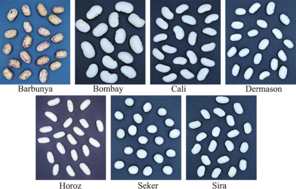

# Portfolio

---

### Regression

#### Predicting Cars Prices

---
#### Predicting House Prices with Machine Learning Techniques

Credit: kaggle.com

---

### Multivariate Data Analysis

#### Multivariate Analysis of Contaminants in Farmed and Wild Salmon

#### Diagnostics

---

### Time Series

#### Using Time Series to Indirectly Predict Weather Patterns

---

### Design and Analysis of Experiments

#### On the Rise of Bread: Which Variables Contribute To The Height Of A Bread?

Credit: thebreadmaiden.com

---

### Mathematical Methods for Data Visualization

#### Dry Bean Data Visualization

Credit: Murat Koklu and Ilker Ali Ozkan

[]
(https://github.com/vkaylyn/vkaylyn.github.io/blob/main/projects/Math%20250%20Paper.pdf)

---

### Miscellaneous Projects

#### DATA SCIENCE FOR GOOD: PASSNYC
#### Help PASSNYC Determine Which Schools Need Their Services The Most

Credit: wallpapercave.com

